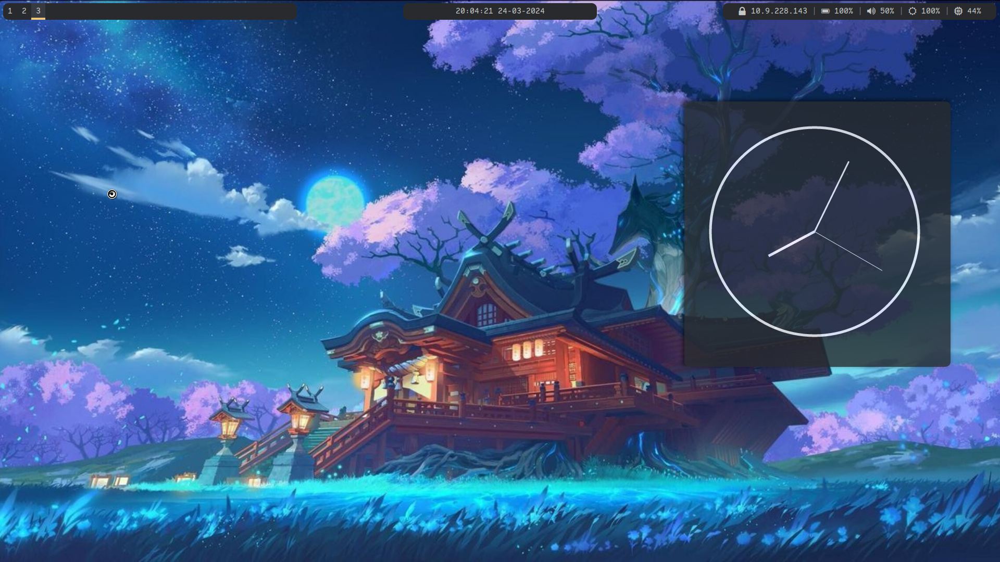

# i3 window manager

Written in C language, the i3wm ( i3 Windows Manager ) is a lightweight, easy-to-configure, and hugely popular tiling windows manager. Unlike the conventional desktop environment, a tiling manager provides just sufficient functionality to arrange windows on your screen in an easy and appealing manner suited for your workflow.

### Screenshots
- Terminal

- Desktop

